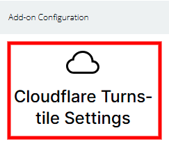
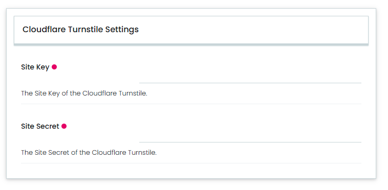
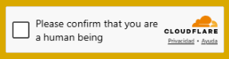

---
myst:
  html_meta:
    "description": "Cloudflare Turnstile integration with Volto how-to guides"
    "property=og:description": "Cloudflare Turnstile integration with Volto how-to guides"
    "property=og:title": "Cloudflare Turnstile integration with Volto how-to guides"
    "keywords": "Cloudflare, Turnstile, service, Volto, integration, documentation, how-to, guides"
---

# General information

This part of the documentation contains how-to guides, including installation and usage.

## Features

- Control panel in {term}`Plone` registry to manage {term}`Cloudflare Turnstile Settings`.

- A Restricted RESTful API endpoint that exposes the {term}`Cloudflare Turnstile Settings` for {term}`Volto` _integration_.

- A Public RESTful API endpoint to get the {term}`Site key` from the {term}`Cloudflare Turnstile Settings` settings.

## Plone CMS integration

To use this product in {term}`Plone` CMS, you needs to include the following {term}`add-on` in your project: {term}`collective.volto.turnstile`.

## Translations

This product has been translated into

- English

- Spanish

## Compatibility

- Tested with `Node.js` 22.16.0 and {term}`Volto` 18.

## Install it

To install in your project, the {term}`volto-turnstile` {term}`add-on`, you must choose the method appropriate
to your version of {term}`Volto`.


### Volto 18 and later

```{warning}
Just for the {term}`Volto` 18 and later versions project installation.
```

Add {term}`volto-turnstile` to your `package.json` file:

```json
"addons": [
    "volto-turnstile": "*"
]
```

```json
"dependencies": {
    "volto-turnstile": "*"
}
```

#### Install from Github

If you trying to install from Github you need edit the `mrs.developer.json` file:

```json
{
  "volto-turnstile": {
    "develop": true,
    "output": "./packages/",
    "package": "volto-turnstile",
    "url": "git@github.com:collective/volto-turnstile.git",
    "https": "https://github.com/collective/volto-turnstile.git",
    "branch": "main"
  }
}
```

The `mrs.developer.json` file is using by an `NodeJS` utility called `mrs.developer` that makes
it easy to work with `NPM` projects containing lots of packages, of which you only want to
develop some.

Also add {term}`volto-turnstile` to your `package.json` file:

```json
"addons": [
    "volto-turnstile": "*"
]
```

```json
"dependencies": {
    "volto-turnstile": "workspace:*",
}
```

---

### Volto 17 and earlier

```{warning}
Just for the {term}`Volto` 17 and earlier versions project installation.
```

Create a new {term}`Volto` project (you can skip this step if you already have one):

```
npm install -g yo @plone/generator-volto
yo @plone/volto my-volto-project --addon volto-turnstile
cd my-volto-project
```

Add {term}`volto-turnstile` to your `package.json` file:

```json
"addons": [
    "volto-turnstile"
],

"dependencies": {
    "volto-turnstile": "*"
}
```

Download and install the new {term}`add-on` by running:

```shell
yarn install
```

Start volto with:

```shell
yarn start
```

## Enable it

Visit http://localhost:3000/ in a browser, login, so go to the `Site setup`, next to the `Add-ons` control panel, 
find the {term}`collective.volto.turnstile` {term}`add-on` and click on the `Install` button for enabled it.

## Settings it

To use this {term}`add-on`, go to the `Site setup`, next to the ``Add-on Configuration`` icon, as shown below:



This {term}`Cloudflare Turnstile Settings`, you can access the control panel, as shown below:



In this control panel, you can configure the following fields:

- {term}`Site Key`, **(public key)**.

- {term}`Secret Key`, **(private key)**.

## Use it

To use the {term}`Cloudflare Turnstile` integration you need add the {term}`volto-turnstile` {term}`add-on`, in
your {term}`Volto` project and use the amazain features incluided.

```{tip}
For example, to secure your forms, you need yo use the {term}`TurnstileWidget` component in your source code forms
as the following:
```


```
import TurnstileWidget from 'volto-turnstile/components/TurnstileWidget/TurnstileWidget';
import { useState, useRef } from 'react';
...

const ContactForm = (props) => {
  // Reference for the Turnstile widget
  const turnstileRef = useRef(null);
  // State for storing the Turnstile token
  const [turnstileToken, setTurnstileToken] = useState(null);
  ...

  return (
    <form ...>
      ...
      <div className="turnstile-container">
        {/* Turnstile widget integrated into the form */}
        <TurnstileWidget
          ref={turnstileRef}
          siteKey="1x00000000000000000000AA",
          className="turnstile-widget"
          style={{ marginTop: '1rem' }}
          onSuccess={(token) => {
            setTurnstileToken(token); // It is triggered when the user passes the validation
          }}
          onExpire={() => {
            setTurnstileToken(null); // It restarts if the token expires
          }}
          onError={() => {
            setTurnstileToken(null);
            'Error in the anti-spam validation.',
          }}
          options={{
            theme: 'light',
            size: 'normal',
          }}
        />
      </div>
    </form>
  );
};

export default ContactForm;
```

The code above is pseudocode that you need to adapt to your form; it generates the following widget:



This way, you can enhance the security of your forms using the {term}`Cloudflare Turnstile` service.
